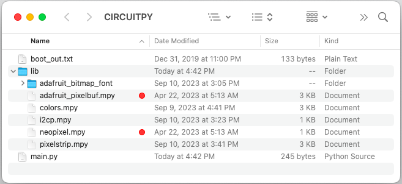
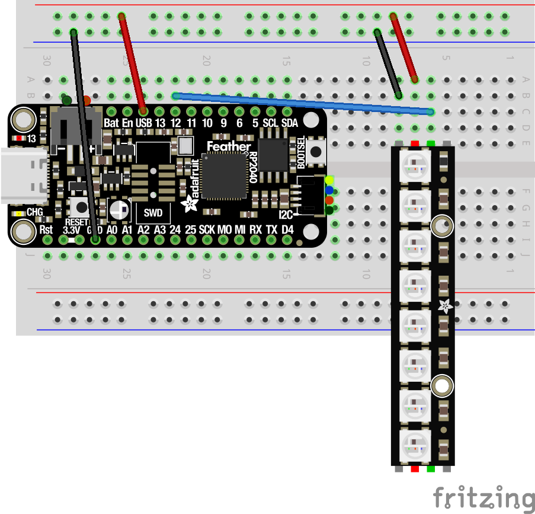

# PixelStrip_CircuitPython

PixelStrip is a small extension to AdaFruit's [Neopixel library](https://github.com/adafruit/Adafruit_CircuitPython_NeoPixel) for [CircuitPython](https://learn.adafruit.com/welcome-to-circuitpython).  The PixelStrip library allows you to add Animations to the strip.  Multiple strips can have separate animations that run in parallel.

This code has been tested on the [Adafruit Feather RP2040](https://learn.adafruit.com/adafruit-feather-rp2040-pico) and the [Raspberry Pi Pico](https://www.raspberrypi.com/products/raspberry-pi-pico/).

## Installation

First, install the latest version of CircuitPython, [downloading a UF2 file specific for your device](https://learn.adafruit.com/welcome-to-circuitpython/installing-circuitpython).  Your device will then appear as a USB drive on your computer named CIRCUITPY.  The drive will have a `lib` directory and the default program named `main.py`.

Second, [download the latest CircuitPython libraries](https://circuitpython.org/libraries).
This package will contain the latest `neopixel.mpy` library, and others.

On your laptop, download [Visual Studio Code](https://code.visualstudio.com/) with the [CircuitPython](https://marketplace.visualstudio.com/items?itemName=joedevivo.vscode-circuitpython) extension.  (Although most of the CircuitPython tutorials use the [Mu](https://codewith.mu/) editor,  I choose to work mostly with Visual Studio Code, since VSC is supported by [FIRST](https://www.firstinspires.org/) robotics.)

Now, copy the following libaries into the `lib` directory:
* `neopixel.mpy` and `adafruit_pixelbuf.mpy` taken from the CircuitPython libraries
* The whole folder for `adafruit_bitmap_font`.
* `pixelstrip.mpy` and `colors.mpy` 



You can now experiment with CircuitPython programs by editing the `main.py` file on the CIRCUITPY drive.

## Trivial Example - Blinking the onboard LED

The Feather RP2040 board has a tiny LED near the USB plug, which we can cause to blink.  Save the following code into your board with the file name `code.py`:

```python
from time import sleep
import board
import digitalio

led = digitalio.DigitalInOut(board.LED)
led.direction = digitalio.Direction.OUTPUT

while True:
    led.value = True
    sleep(0.5)
    led.value = False
    sleep(0.5)
```

This blink program is very useful because it verifies that the basic hardware and software is working.  If you ever reach a point there the board isn't doing anything, you can always load in the blink program to verify that your hardware is wired and powered, that your IDE is working and files are being delivered through USB.

## Another Trivial Example - Blinking the onboard NeoPixel

The Feather board has a single NeoPixel near the reset button.  Save the following code into your Feather with the file name `code.py`:

```python
from time import sleep
import board
import neopixel

pixel = neopixel.NeoPixel(board.NEOPIXEL, 1, brightness=0.3)
color = (0, 128, 128, 0)

while True:
    pixel.fill(color)
    sleep(0.5)
    pixel.fill((0, 0, 0, 0))
    sleep(0.5)
```

You can use the onboard LED and NeoPixel for testing and debugging.  For instance, you might blink the LED every time you receive an I2C signal, so you will know that the signals are getting through.  You might change the NeoPixel color to reflect a sensor value, so you will know that the sensor is working.

## Simple Example - Blinking a NeoPixel Strip

Wire up your Neopixels (WS2812B LEDs) for 5 volts, the ground, and digital input connecting  to one of the board's GPIO pins (pin 12 in the following examples).



In code, create a PixelStrip object and assign colors to specific LEDs. Colors are coded as tuples of four integers, each between 0 and 255.

```python
from time import sleep
import board
import pixelstrip

# Create a PixelStrip object connected to digital IO pin GP15
strip = pixelstrip.PixelStrip(board.GP15, 8, auto_write=True)

# Assign color values to individual LEDs
while True:
    strip[0] = (128, 0, 0, 0)
    sleep(0.5)
    strip[0] = (0, 0, 0, 0)
    sleep(0.5)
```

## Animation Example

Animations on a strip can be changed at any time.

New animations should extend `pixelstrip.Animation` and must at least define a new `draw()` function.

```python
import board
import pixelstrip

# Define a new Animation
class BlinkAnimation(pixelstrip.Animation):
    def __init__(self):
        pixelstrip.Animation.__init__(self)

    def reset(self, strip):
        self.timeout = 1.0

    def draw(self, strip, delta_time):
        if self.is_timed_out():
            self.timeout = 1.0
            lights_on = strip[0][0] != 0
            if lights_on:
                strip.fill((0, 0, 0, 0))
            else:
                strip[0] = (128, 0, 0, 0)
            strip.show()

# Create a PixelStrip object connected to digital IO pin GP15
strip = pixelstrip.PixelStrip(board.GP15, 8, bpp=4, pixel_order=pixelstrip.GRB)

# Assign an instance of the new Animation into the strip
strip.animation = BlinkAnimation()

# Repeatedly draw the strip, causing the Animation to run
while True:
    strip.draw()
```

> Note that the `PixelStrip` constructor contains special arguments for `bpp` and `pixel_order`.
> Depending on the WS2812B pixels you purchase, you might need to tweak these values.
> The `bpp` parameter determines "bytes per pixel" and should almost always be 4. The `pixel_order` parameter determines the order in which colors are addressed.
> The most common pixel orders seem to be `pixel_order=RGBW` if your pixels have a "white" channel or `pixel_order=GRB` if there is no extra channel.
