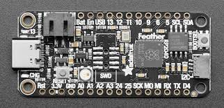
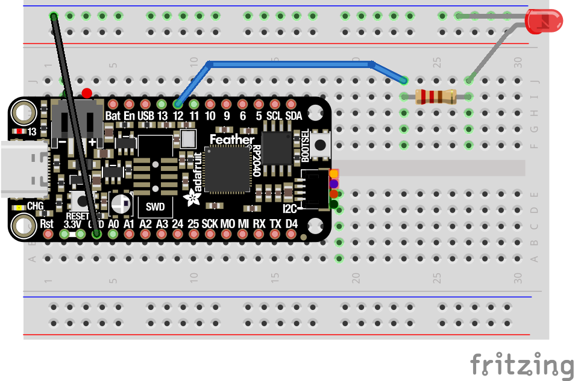

# Setup for CircuitPython

Microcontrollers are miniature computers for use with electronics.  We will be programming the [Adafruit Feather RP2040](https://www.adafruit.com/product/4884) with the [CircuitPython](https://circuitpython.org/) language, which is an implementation of [Python 3](https://www.python.org/) for microcontrollers.  This is a powerful language in its own right, but skills developed in Python will be applicable to programming in [Java](https://en.wikipedia.org/wiki/Java_(programming_language)), [C](https://en.wikipedia.org/wiki/C_(programming_language)), or other languages.



You will need a Feather RP2040, a USB C cable, and a laptop. Install the [Visual Studio Code](https://code.visualstudio.com/) application.  Within Visual Studio Code (VSC), add the [CircuitPython plugin](https://marketplace.visualstudio.com/items?itemName=joedevivo.vscode-circuitpython).

To set up your Feather, you'll need to get the UF2 file containing the [latest version of CircuitPython](https://circuitpython.org/board/adafruit_feather_rp2040/).  Connect the micro USB cable to you Feather. Hold down the BOOTSEL button on the Pico before connecting the cable to your laptop.  A new drive should appear on the laptop.  Drag the UFC file onto the new drive.  After the file has loaded, unplug the cable from your laptop and then replug it.

The Feather will appear as a new flash disk called CIRCUITPY.  If you edit files on this volume, they will immedietly start executing under CircuitPython.  You can restart the code at any time by clicking the "Reset" button on the Feather.

## Blink Code

In the main window, type the following:

```python
from time import sleep
import board
import digitalio

led = digitalio.DigitalInOut(board.LED)
led.direction = digitalio.Direction.OUTPUT

while True:
    led.value = True
    sleep(0.5)
    led.value = False
    sleep(0.5)
```

Save this program onto your Feather with the file name `main.py`, and then click the little green "Run" icon.  A small LED on the Feather should start blinking.  You can start and stop the program.  Modify the program to blink at different rates.



Now try setting up this circuit on your breadboard.  The resistor can be any size, and should be connected to GPIO pin 16.  Note that the LED has a long wire and a short wire; the short wire should connect to the blue ground rail and the long wire should be connected near the resistor. (The long wire is called the Annode, while the short wire is called the Cathode.) Next, try adding more LEDs

```python
from time import sleep
import board
import digitalio

pin_12 = digitalio.DigitalInOut(board.D12)
pin_12.direction = digitalio.Direction.OUTPUT
toggle = True

while True:
    pin_12.value = toggle
    sleep(1.0)
    toggle = not toggle
```

---

## Other Things to Try:
* Add switches for digital inputs.
* Code a traffic light

## References:
* Feather RP2040 documentation:  https://learn.adafruit.com/adafruit-feather-rp2040-pico
* Feather RP2040 Pinout diagram:  https://cdn-learn.adafruit.com/assets/assets/000/100/740/medium800/adafruit_products_RP2040Pinout300DPI.png

