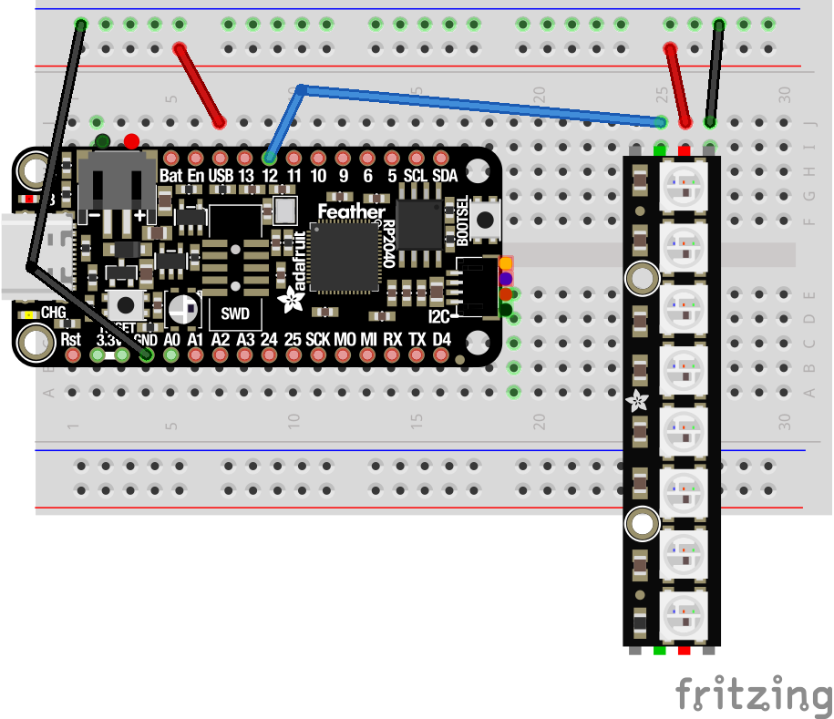

# PixelStrip in CircuitPython

PixelStrip is a [CircuitPython](https://circuitpython.org/) module for controlling WS2812 RGB LEDs on the [Adafruit Feather RP2040](https://www.adafruit.com/product/4884).  These LEDs are also known as  [NeoPixels](https://learn.adafruit.com/adafruit-neopixel-uberguide). The PixelStrip library allows you to add Animations to the strip.  Multiple strips can have separate animations that run in parallel.

Wire up your Neopixels (WS2812B LEDs) to power, ground, and digital input. In the following example we will use GP4 for digital input.



Copy the `pixelstrip.py`, and `colors.py` files into your Feather.  Then create the following in a file named `main.py`:

```python
from utime import sleep
from pixelstrip import PixelStrip
from colors import *

strip = PixelStrip(board.D12, 8, pixel_order=pixelstrip.RGB)

while True:
    strip[0] = (0, 64, 64)
    strip.show()
    sleep(0.5)
    strip[0] = (0, 0, 0)
    strip.show()
    sleep(1.5)
```

Note that colors are denoted with tuples of red, green, and blue values.  Each color component value is a number from 0 through 255.  You can also use predefined colors from the `colors.py` file.

Here's a program that uses a loop to set multiple pixels:

```python
from utime import sleep
from pixelstrip import PixelStrip

strip = PixelStrip(board.D12, 8, pixel_order=pixelstrip.RGB)

while True:
    r = 128
    g = 0
    for p in range(len(strip)):
        strip[p] = (r, g, 0)
        r = r - 12
        g = g + 12
    strip.show()
    
    sleep(1.5)
    strip.clear()
    strip.show()
    sleep(0.5)
```

Here is a program that uses a 'timeout' on the PixelStrip.

```python
from pixelstrip import PixelStrip
from random import randint

strip = PixelStrip(board.D12, 8, pixel_order=pixelstrip.RGB)
strip.timeout = 1.0

while True:
    if strip.is_timed_out():
        r = randint(0, 255)
        g = randint(0, 255)
        b = randint(0, 255)
        strip[0] = (r, g, b)
        strip.show()
        strip.timeout = 1.0
```
