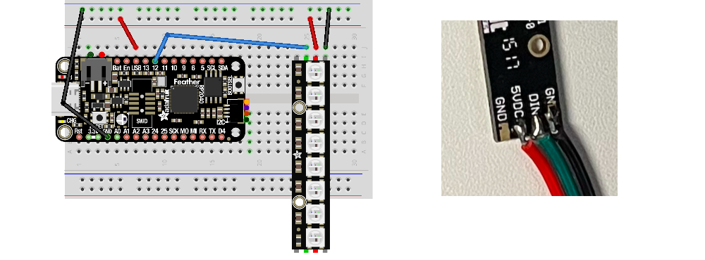

# PixelStrip in CircuitPython on the Feather microcontroller

PixelStrip is a [CircuitPython](https://circuitpython.org/) module for controlling WS2812 RGB LEDs on the [Adafruit Feather RP2040](https://www.adafruit.com/product/4884).  These LEDs are also known as  [NeoPixels](https://learn.adafruit.com/adafruit-neopixel-uberguide). The PixelStrip library allows you to add Animations to the strip.  Multiple strips can have separate animations that run in parallel.

Wire up your Neopixels (WS2812B LEDs) to power, ground, and digital input. In the following example we will use `board.D12` for digital input.



Copy the `pixelstrip.mpy`, and `colors.mpy` files into your board's `lib` directory.   Then create the following in a file named `main.py`:

```python
from utime import sleep
import pixelstrip
from colors import *

strip = pixelstrip.PixelStrip(board.D12, 8, pixel_order=pixelstrip.GRB)

while True:
    strip[0] = (0, 64, 64, 0)
    strip.show()
    sleep(0.5)
    strip[0] = (0, 0, 0, 0)
    strip.show()
    sleep(1.5)
```

Note that colors are denoted with tuples of red, green, and blue values.  Each color component value is a number from 0 through 255.  You can also use predefined colors from the `colors.mpy` file.

Here's a program that uses a loop to set multiple pixels:

```python
from utime import sleep
import pixelstrip

strip = pixelstrip.PixelStrip(board.D12, 8, pixel_order=pixelstrip.GRB)

while True:
    r = 128
    g = 0
    for p in range(len(strip)):
        strip[p] = (r, g, 0)
        r = r - 12
        g = g + 12
    strip.show()
    
    sleep(1.5)
    strip.clear()
    strip.show()
    sleep(0.5)
```

Here is a program that uses a 'timeout' on the PixelStrip.

```python
import pixelstrip
from random import randint

strip = pixelstrip.PixelStrip(board.D12, 8, pixel_order=pixelstrip.GRB)
strip.timeout = 1.0

while True:
    if strip.is_timed_out():
        r = randint(0, 255)
        g = randint(0, 255)
        b = randint(0, 255)
        strip[0] = (r, g, b, 0)
        strip.show()
        strip.timeout = 1.0
```
***

# PixelStrip in CircuitPython on the Raspberry Pi Pico

PixelStrip is a [CircuitPython](https://circuitpython.org/) module for controlling WS2812 RGB LEDs microcontroller boards, including the [Raspberry Pi Pico](https://www.raspberrypi.com/products/raspberry-pi-pico/).  These LEDs are also known as  [NeoPixels](https://learn.adafruit.com/adafruit-neopixel-uberguide). The PixelStrip library allows you to add Animations to the strip.  Multiple strips can have separate animations that run in parallel.

Wire up your Neopixels (WS2812B LEDs) to power, ground, and digital input. In the following example we will use `board.GP15` for digital input.


Copy the `pixelstrip.mpy`, and `colors.mpy` files into your board's `lib` directory.  Then create the following in a file named `main.py`:

```python
from utime import sleep
import pixelstrip
from colors import *

strip = pixelstrip.PixelStrip(board.GP15, 8, pixel_order=pixelstrip.GRB)

while True:
    strip[0] = (0, 64, 64, 0)
    strip.show()
    sleep(0.5)
    strip[0] = (0, 0, 0, 0)
    strip.show()
    sleep(1.5)
```

Note that colors are denoted with tuples of red, green, and blue values.  Each color component value is a number from 0 through 255.  You can also use predefined colors from the `colors.mpy` file.

Here's a program that uses a loop to set multiple pixels:

```python
from utime import sleep
import pixelstrip

strip = pixelstrip.PixelStrip(board.GP15, 8, pixel_order=pixelstrip.GRB)

while True:
    r = 128
    g = 0
    for p in range(len(strip)):
        strip[p] = (r, g, 0, 0)
        r = r - 12
        g = g + 12
    strip.show()
    
    sleep(1.5)
    strip.clear()
    strip.show()
    sleep(0.5)
```

Here is a program that uses a 'timeout' on the PixelStrip.

```python
import pixelstrip
from random import randint

strip = pixelstrip.PixelStrip(board.GP15, 8, pixel_order=pixelstrip.GRB)
strip.timeout = 1.0

while True:
    if strip.is_timed_out():
        r = randint(0, 255)
        g = randint(0, 255)
        b = randint(0, 255)
        strip[0] = (r, g, b, 0)
        strip.show()
        strip.timeout = 1.0
```
