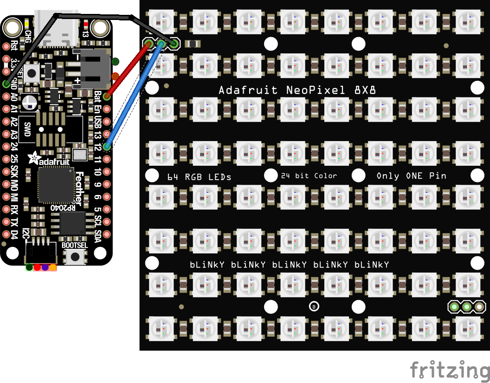

# PixelStrip Matrices

We can do a lot of impressive animations with strips of WS2812B LEDs.  We can also use the same software to control 2-dimensional matrixes of LEDs.  Matrices are more dramatic, although they are also more expensive and they consume more electrical current.



Wiring a matrix is the same as a pixel strip.  You'll need the same two support files loaded onto your microcontroller: `pixelstrip.py`, and `colors.py`.  When creating a Python object to represent the matrix, you'll specify `height` and `width` parameters. You may also need to an `option` parameter, depending on how the matrix is wired and how it is positioned.  Individual pixels are addrssed by row and column.

Here's a simple matrix program:

```python
import pixelstrip
import board

matrix = pixelstrip.PixelStrip(board.D12, width=8, height=8, bpp=4, pixel_order=pixelstrip.GRB)
matrix.timeout = 0.0
i = 0

while True:
    if matrix.is_timed_out():
        matrix.clear()
        matrix[i, i] = (0, 0, 128, 0)
        matrix.show()
        i = (i + 1) % 8
        matrix.timeout = 0.7
```

You can break a complex program into smaller functions:

```python
import pixelstrip
import board
from colors import *

matrix = pixelstrip.PixelStrip(board.D12, width=8, height=8, bpp=4, pixel_order=pixelstrip.GRB)
matrix.timeout = 0.0
c = 0

def draw_vertical_line(m, col, color):
    for row in range(m.width):
        m[col, row] = color

while True:
    if matrix.is_timed_out():
        matrix.clear()
        draw_vertical_line(matrix, c, YELLOW)
        matrix.show()
        matrix.timeout = 0.5
        c = (c + 1) % matrix.height
```

Here's another function for drawing:

```python
from random import randint
import pixelstrip
import board
from colors import *

matrix = pixelstrip.PixelStrip(board.D12, width=8, height=8, bpp=4, pixel_order=pixelstrip.GRB)
matrix.timeout = 0.0

def draw_box(m, x, y, color):
    m[x, y] = color
    m[x+1, y] = color
    m[x, y+1] = color
    m[x+1, y+1] = color

while True:
    if matrix.is_timed_out():
        matrix.clear()
        r = randint(0, matrix.width-2)
        c = randint(0, matrix.height-2)
        draw_box(matrix, c, r, BLUE)
        matrix.show()
        matrix.timeout = 1.0
```

In the long run, we want light matrix demos to be in the form of Animation classes:

```python
import pixelstrip
import board
from colors import *

# Define a new Animation
class StripeAnimation(pixelstrip.Animation):
    def __init__(self):
        pixelstrip.Animation.__init__(self)
        self.color = GREEN
        self.row = 0

    def reset(self, matrix):
        self.timeout = 0.0

    def draw(self, matrix, delta_time):
        if self.is_timed_out():     
            matrix.clear()
            for c in range(self.row + 1):
                r = self.row - c
                matrix[c, r] = self.color
            self.row = (self.row + 1) % matrix.height
            matrix.show()
            self.timeout = 0.25


# Create a PixelStrip object connected to digital IO pin GP4
matrix = pixelstrip.PixelStrip(board.D12, width=8, height=8, bpp=4, pixel_order=pixelstrip.GRB)

# Assign an instance of the new Animation into the strip
matrix.animation = StripeAnimation()

# Repeatedly draw the strip, causing the Animation to run
while True:
    matrix.draw()
```
