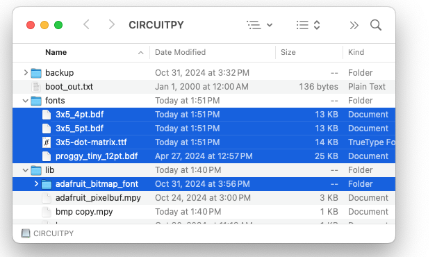

# Displaying Text in PixelStrip Matrices

It is possible to use WS2812B LED matrices to display messages.

You will need to install additional library files, as well as any fonts you will be using:



Here is a simple example which displays two words, with brief pauses between messages:

```python
from time import sleep
import pixelstrip
import board
from colors import *

matrix = pixelstrip.PixelStrip(board.GP15, width=32, height=8, auto_write=True,
                               bpp=4, pixel_order=pixelstrip.GRB,
                               options={pixelstrip.MATRIX_TOP, pixelstrip.MATRIX_LEFT,
                                        pixelstrip.MATRIX_COLUMN_MAJOR, pixelstrip.MATRIX_ZIGZAG})

matrix.brightness = 0.3
matrix.load_font("fonts/proggy_tiny_12pt.bdf")
matrix.clear()

while True:
    matrix.draw_text("Hello")
    sleep(1.0)
    matrix.clear()
    matrix.draw_text("World")
    sleep(2.0)
    matrix.clear()
```

## References:
* [Fonts for CircuitPython Displays](https://learn.adafruit.com/custom-fonts-for-pyportal-circuitpython-display)
* [Adafruit Bitmap Font Library](https://docs.circuitpython.org/projects/bitmap-font/en/latest/index.html)
* [Adafruit fontio Library](https://docs.circuitpython.org/en/latest/shared-bindings/fontio/index.html)
