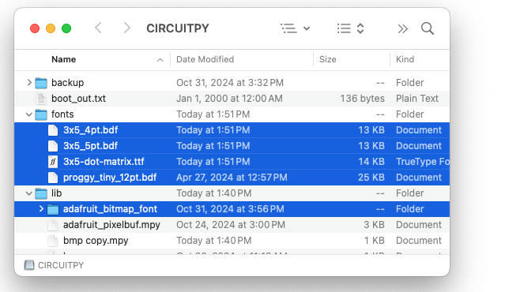

# Bitmap display on an LED matrix

The `PixelStrip` can display graphics files using the `BmpFile` class.  At this time, this only works with [BMP](https://en.wikipedia.org/wiki/BMP_file_format) files.  And at this time, it only works with _some_ BMP file formats.  The most reliable way of creating compatible BMP files is with Microsoft Paint.

The BMP files must be copied onto the microcontroller:



The `BitmapAnimation` class will cycle through a list of files.  By default, images will switch once a second.  You can change the speed by modifying `cycle_time` in the constructor.

```python
if __name__ == "__main__":
    matrix = pixelstrip.PixelStrip(board.GP15, width=8, height=8, bpp=4, pixel_order=pixelstrip.GRB)
    matrix.animation = BitmapAnimation(['test1_8x8.bmp', 'test2_8x8.bmp'], cycle_time=1.0)
    while True:
        matrix.draw()
```
