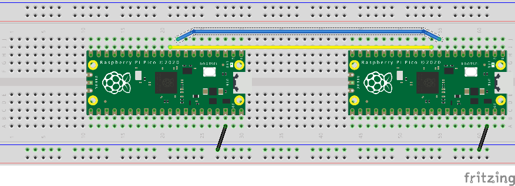
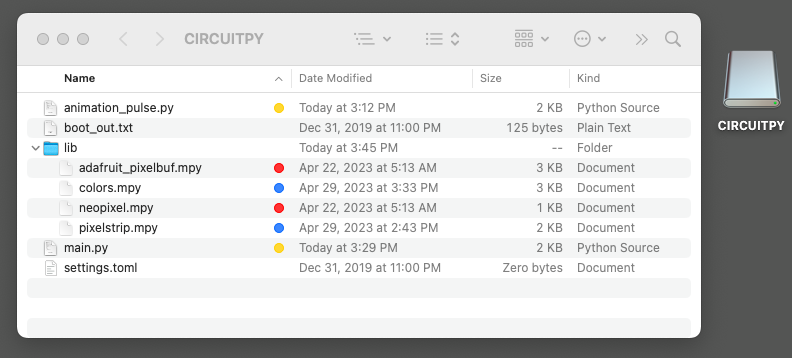
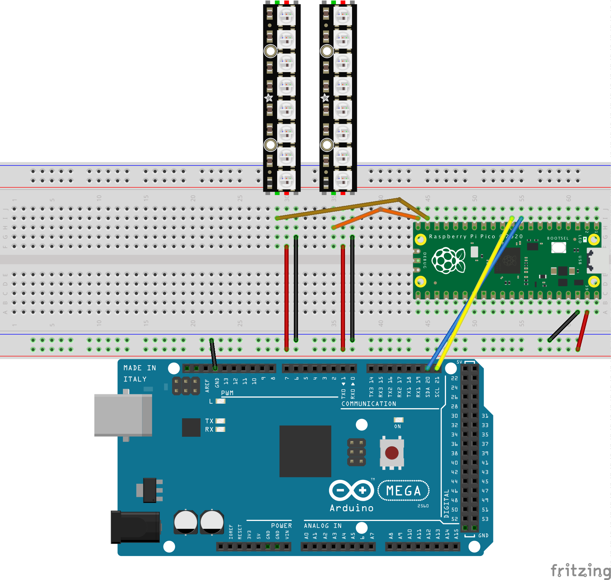

# I2C communication

The [Inter-Integrated Circuit](https://en.wikipedia.org/wiki/I%C2%B2C) bus is a mechanism allowing electrical components to talk to each other.  We can use it to communcate between microcontrollers such as Arduinos, Raspberry Pi Picos, or Feather boards.  These boards can also use I2C to talk to computers, such as the Raspberry Pi or the RoboRIO.

This directory contains example code allowing [CircuitPython](https://learn.adafruit.com/welcome-to-circuitpython) code to operate on the I2C bus.

# Wire Library Example

The Arduino supports a simple library called [Wire](https://www.arduino.cc/reference/en/language/functions/communication/wire/) for allowing Arduinos to communicate through I2C.  The documentation for Wire contains an [excellent example](https://wiki-content.arduino.cc/en/Tutorial/LibraryExamples/MasterWriter#code) where one Arduino to talks to another.

A similar example can be created allowing two CircuitPython boards to talk to each other.  The `wire_writer.py` program sends out a short text message every three seconds.  The `wire_receiver.py` program receives that message and prints it out to the serial terminal.  Note that the writer flashes its onboard LED whenever a message is sent, and the reader program flashes its LED whenever a message is received.  You should see both boards flashing their onboard LEDs at the same time.



# I2C Animation Test

This project demonstrates that NeoPixel strips connected to a microcontroller can have their animations changed based on I2C communication from an Arduino.  The project has two parts:

* `i2c_animation_tester_arduino.ino` is an Arduino program.  It acts as an I2C controller (master device) on the I2C bus.  Every five seconds, it picks a new strip number and animation number. These numbers are coded into a single byte, and the program sends out one byte message on the bus, which should cause animations to change.
* `i2c_animations.py` is a MicroPython program for the Raspberry Pi Pico.  It acts as an I2C target also on the I2C bus.  When it receives a single byte message, it decodes the strip number and animation number from that byte, and then changes the animations on one strip.

When the Arduino sends out its message, it also causes its onboard LED to light for half a  second.  When the Pico receives a message, it causes the Pico's onboard LED to light for half  a second.  If everything is wired correctly, you should see both LEDs blinking at the same time.

## Arduino Software Installation

The Arduino program `i2c_animation_tester.ino` should be loaded with the [Arduino IDE](https://www.arduino.cc/).

For the Pico program, files should be installed onto the Pico.  First copy the file `i2c_animations.py` and then rename the copy to be `main.py`. Then install:
* `neopixel.mpy` and `adafruit_pixelbuf.mpy` taken from the CircuitPython libraries
* `pixelstrip.mpy` and `colors.mpy` taken from the PixelStrip repository
* `main.py`, copied from `i2c_animations.py`
* `animation_pulse.py` copied from the PixelStrip examples.  Comment out the "main" routine in the last 8 lines of this file.



## Arduino Hardware Setup

Connect the Arduino's SDA and SCL pins to corresponding pins on the Pico.  For this example, we are configuring the Pico's GP6 and GP7 pins for I2C.  Also connect ground wires between the two boards.  Ignore the power pin.

When possible, stick to the [Qwiic convention](https://learn.adafruit.com/introducing-adafruit-stemma-qt/technical-specs) of using yellow wire for clock and blue for data.

Wire the two NeoPixel strips to ground, power, and two data pins.  In this example, we are using the Pico's GP4 and GP5 pins for pixel data.



## RoboRIO Software Installation

The `Robot.java` file is a [RoboRIO](https://www.ni.com/en-us/support/model.roborio.html) program.  

This program assumes that you use an XBox controller, but you can easily modify it for any other joystick or game controller. This is a demonstration program that lets you change animations on the Pico.  You can use it as a base for creating a more sophisticated robot program that utilizes PixelStrips.

Starting with Visual Studio Code where you have installed the [WPILib package](https://docs.wpilib.org/en/stable/docs/zero-to-robot/step-2/index.html).  Execute the "Create a new project" task and then select: Template > Java > Timed Skeleton.  From the resulting project, open up the `Robot.java` file and then copy in the value from this repository.

# RoboRIO Hardware Setup

Connect the Pico's ground, clock, and data pins to the I2C pins on the top of the RoboRIO. Don't worry about the power pin.


# i2c_sender

This application runs on a SparkFun [RedBoard Artemis ATP](https://www.sparkfun.com/products/15442).  It generates I2C signals to trigger animations changes.

### Arduino IDE setup

I developed this using the [Arduino IDE](https://arduino.cc) version 1.8.19. Add some things to your Arduino IDE for [Artemis Development](https://learn.sparkfun.com/tutorials/artemis-development-with-arduino/all).

File > Preferences

Paste the following into the "Additional Board Manager URLs" window:
```
https://raw.githubusercontent.com/sparkfun/Arduino_Boards/main/IDE_Board_Manager/package_sparkfun_index.json
https://adafruit.github.io/arduino-board-index/package_adafruit_index.json
```

Tools > Board > Boards Manager...

Search for "Apollo" and then install the "SparkFun Apollo3 Boards" package.


